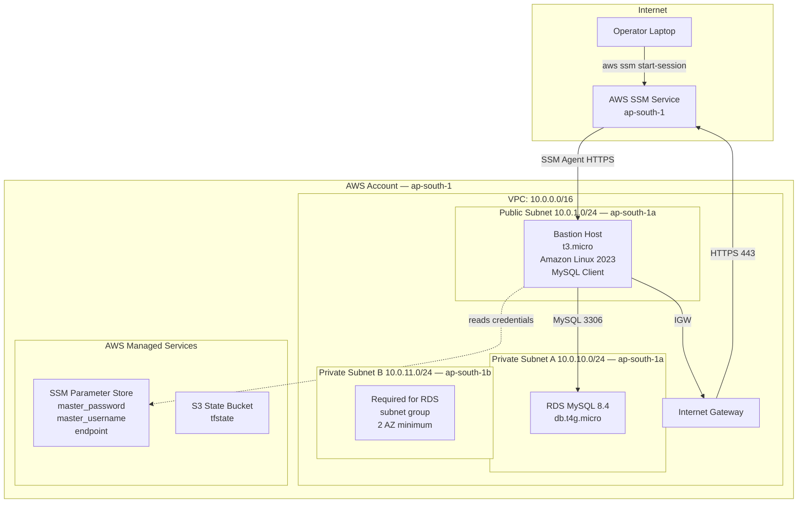
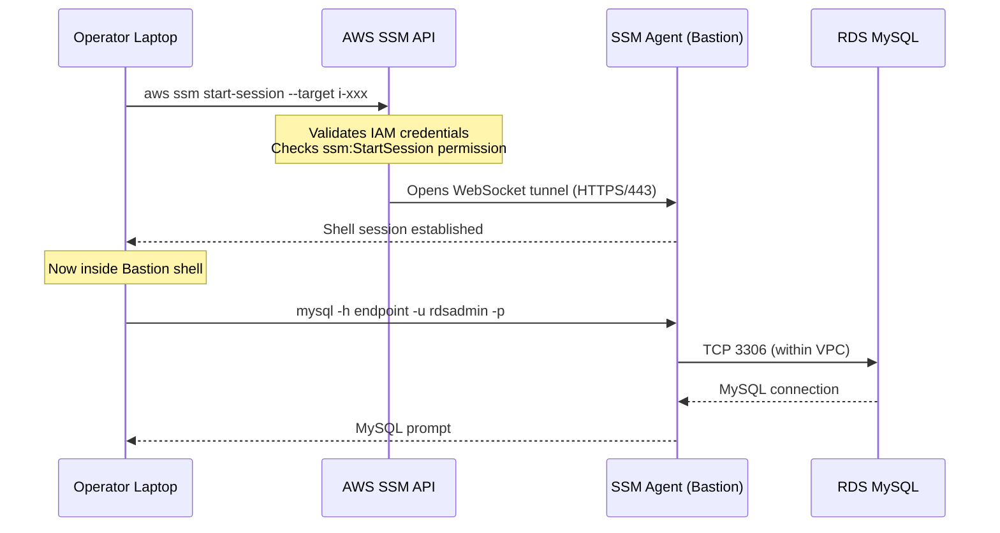
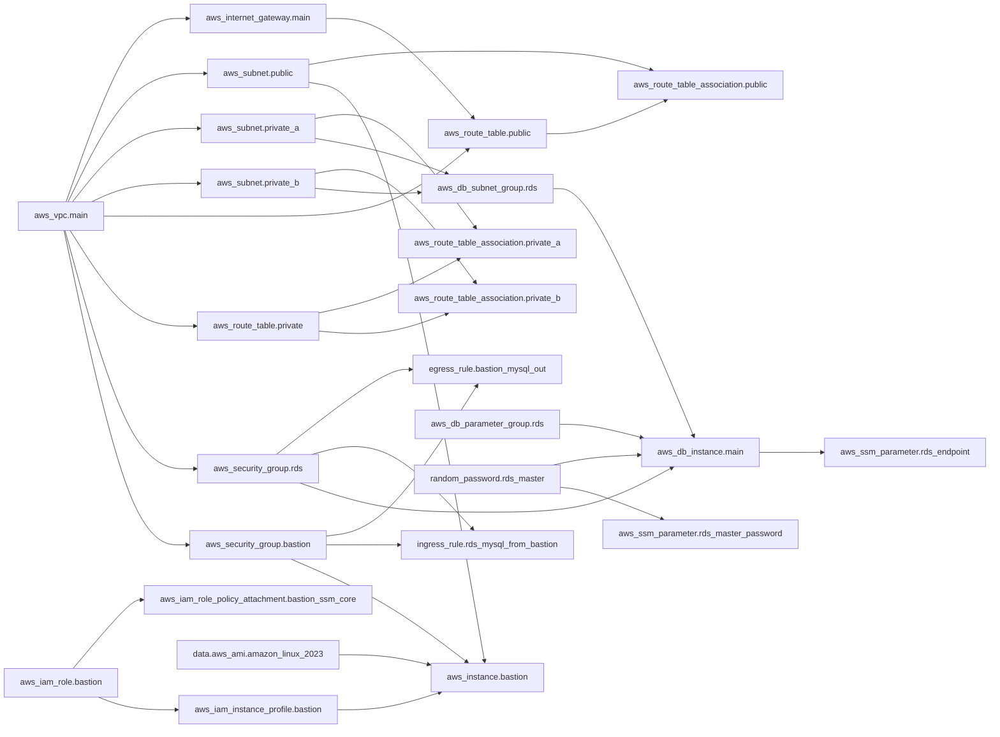
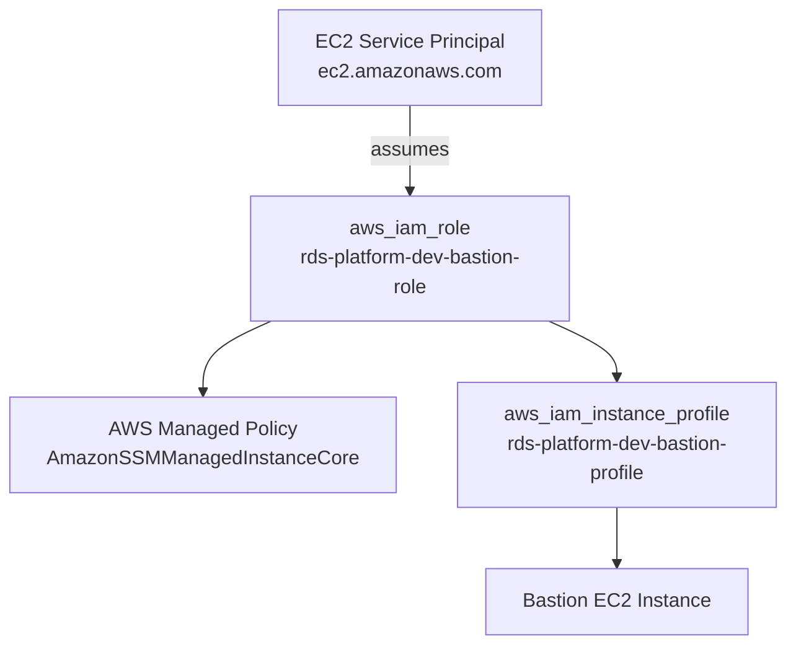
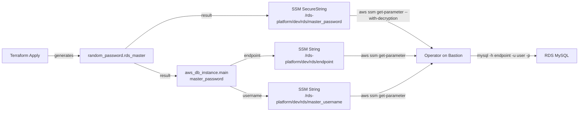
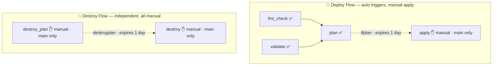

# AWS RDS MySQL — Terraform & GitLab CI/CD Setup Guide

> **For use in Notion:** Paste this file into a Notion page. All diagrams, tables, and code blocks render correctly. Use "Toggle" blocks to collapse sections.

---

## Table of Contents

1. [Project Summary](#1-project-summary)
2. [Architecture Diagrams](#2-architecture-diagrams)
3. [Network Architecture](#3-network-architecture)
4. [Security Architecture](#4-security-architecture)
5. [IAM and Access Model](#5-iam-and-access-model)
6. [RDS Instance Design](#6-rds-instance-design)
7. [Secret Management](#7-secret-management)
8. [Terraform File Map](#8-terraform-file-map)
9. [CI/CD Pipeline Deep Dive](#9-cicd-pipeline-deep-dive)
10. [State Management](#10-state-management)
11. [Operator Runbook](#11-operator-runbook)
12. [Cost Analysis](#12-cost-analysis)
13. [Destroy Runbook](#13-destroy-runbook)
14. [Prerequisites Checklist](#14-prerequisites-checklist)
15. [Troubleshooting Guide](#15-troubleshooting-guide)

---

## 1. Project Summary

| Attribute | Value |
|---|---|
| **Project Name** | terraform-aws-rds-mysql-platform |
| **AWS Region** | ap-south-1 (Mumbai) |
| **Database** | Amazon RDS MySQL 8.4 |
| **Instance Type** | db.t4g.micro (Free Tier eligible) |
| **IaC Tool** | Terraform >= 1.6.0 |
| **CI/CD** | GitLab CI/CD |
| **State Backend** | AWS S3 (versioned) |
| **Access Method** | AWS SSM Session Manager (no SSH) |
| **Secret Storage** | AWS SSM Parameter Store |

### Design Principles

- **Zero public database exposure** — RDS exists only in private subnets with no internet route
- **No credentials in code** — passwords generated and stored in SSM Parameter Store
- **No SSH from internet** — bastion access via SSM Session Manager (IAM-authenticated)
- **No NAT Gateway** — eliminates $33+/month recurring cost
- **Full destroy capability** — all resources teardown cleanly with `terraform destroy`
- **Minimal tfvars** — only 2 values required to deploy

---

## 2. Architecture Diagrams

### High-Level Architecture


### Data Flow — Operator to RDS MySQL


### Terraform Dependency Graph


---

## 3. Network Architecture

### Subnet Layout

| Subnet | CIDR | AZ | Tier | Route Table | Hosts |
|---|---|---|---|---|---|
| public | 10.0.1.0/24 | ap-south-1a | Public | 0.0.0.0/0 → IGW | Bastion EC2 |
| private_a | 10.0.10.0/24 | ap-south-1a | Private | Local only | RDS MySQL instance |
| private_b | 10.0.11.0/24 | ap-south-1b | Private | Local only | Required for RDS subnet group (2 AZ minimum) |

### Route Tables

**Public Route Table**
| Destination | Target | Purpose |
|---|---|---|
| 10.0.0.0/16 | local | VPC-internal traffic |
| 0.0.0.0/0 | igw-xxxxxxxx | Internet access for Bastion |

**Private Route Table**
| Destination | Target | Purpose |
|---|---|---|
| 10.0.0.0/16 | local | VPC-internal traffic only |

> No NAT Gateway route. No internet path from private subnets. RDS is completely isolated from internet traffic.

### Network Traffic Flows

```
ALLOWED FLOWS:
┌─────────────────────────────────────────────────────────────────┐
│  Internet → Bastion: BLOCKED (no inbound SG rules)             │
│  Bastion → Internet: HTTPS:443, HTTP:80 (package installs)     │
│  Bastion → RDS:      MySQL:3306 (SG-to-SG rule)                │
│  RDS → Internet:     BLOCKED (no route in private RT)          │
│  RDS → Bastion:      Not required (RDS is passive)             │
└─────────────────────────────────────────────────────────────────┘

ACCESS FLOW:
  Operator → [HTTPS API call] → AWS SSM Service
           → [SSM WebSocket tunnel via HTTPS/443]
           → Bastion SSM Agent
           → [mysql client TCP 3306]
           → RDS MySQL (private subnet)
```

---

## 4. Security Architecture

### Security Group Matrix

| SG Name | Inbound | Outbound | Notes |
|---|---|---|---|
| `rds-platform-dev-bastion-sg` | **NONE** | 443/tcp → 0.0.0.0/0, 80/tcp → 0.0.0.0/0, 3306/tcp → rds-sg | Zero attack surface |
| `rds-platform-dev-rds-sg` | 3306/tcp ← bastion-sg | Default (all) | SG-to-SG, not CIDR |

### Security Controls

| Control | Implementation | Why |
|---|---|---|
| No inbound port on Bastion | Zero inbound SG rules | SSM uses outbound HTTPS only |
| No SSH keys | No key_pair on EC2 | Eliminates key management risk |
| No public RDS | `publicly_accessible = false` | Not reachable even if misconfigured |
| Private subnet with no IGW route | Private RT has no default route | Double isolation for RDS |
| SG-to-SG rules | `referenced_security_group_id` | Survives IP changes, tightest scope |
| Encrypted secrets | SSM Parameter Store SecureString | No plaintext credentials anywhere |
| State encryption | S3 backend `encrypt=true` | State file contains sensitive values |

### Attack Surface Analysis

```
INTERNET ATTACK SURFACE: None
  - Bastion: Zero inbound rules — no port scannable
  - RDS: Private subnet, no public IP, no public route

AUTHENTICATED ACCESS ONLY:
  - Bastion shell: Requires valid AWS IAM credentials + ssm:StartSession permission
  - RDS: Requires Bastion access first + MySQL credentials from SSM

CREDENTIALS EXPOSURE RISK: Near zero
  - No passwords in .tfvars
  - No passwords in CI/CD variables
  - No passwords in Terraform outputs (marked sensitive)
  - Passwords in SSM SecureString — encrypted by AWS KMS
```

---

## 5. IAM and Access Model

### IAM Resources Created by Terraform



### AmazonSSMManagedInstanceCore Permissions

This AWS-managed policy grants the SSM agent exactly what it needs:

| Permission | Purpose |
|---|---|
| `ssm:DescribeAssociation` | SSM config sync |
| `ssm:GetDeployablePatchSnapshotForInstance` | Patch management |
| `ssm:GetDocument` | Fetch SSM documents |
| `ssm:DescribeDocument` | Document metadata |
| `ssm:GetManifest` | Agent manifest |
| `ssm:ListAssociations` | List associations |
| `ssm:ListInstanceAssociations` | Instance associations |
| `ssm:PutInventory` | Report inventory |
| `ssm:PutComplianceItems` | Compliance reporting |
| `ssm:PutConfigurePackageResult` | Package results |
| `ssm:UpdateAssociationStatus` | Status updates |
| `ssm:UpdateInstanceAssociationStatus` | Instance status |
| `ssm:UpdateInstanceInformation` | Instance registration |
| `ssmmessages:CreateControlChannel` | Session Manager channel |
| `ssmmessages:CreateDataChannel` | Session Manager data |
| `ssmmessages:OpenControlChannel` | Open session |
| `ssmmessages:OpenDataChannel` | Open data stream |
| `ec2messages:AcknowledgeMessage` | EC2 message queue |
| `ec2messages:DeleteMessage` | Cleanup messages |
| `ec2messages:FailMessage` | Error reporting |
| `ec2messages:GetEndpoint` | Get SSM endpoint |
| `ec2messages:GetMessages` | Poll for commands |
| `ec2messages:SendReply` | Send results |

### Operator IAM Requirements

The operator running `aws ssm start-session` needs:

```json
{
  "Version": "2012-10-17",
  "Statement": [
    {
      "Effect": "Allow",
      "Action": [
        "ssm:StartSession",
        "ssm:DescribeSessions",
        "ssm:GetConnectionStatus",
        "ssm:DescribeInstanceProperties",
        "ec2:DescribeInstances"
      ],
      "Resource": "*"
    },
    {
      "Effect": "Allow",
      "Action": "ssm:TerminateSession",
      "Resource": "arn:aws:ssm:*:*:session/${aws:username}-*"
    }
  ]
}
```

---

## 6. RDS Instance Design

### Instance Configuration

| Parameter | Value | Reason |
|---|---|---|
| Engine | `mysql` | Standard RDS MySQL engine |
| Engine Version | `8.4` | MySQL 8.4 (latest) |
| Instance Class | `db.t4g.micro` | Free Tier eligible |
| Instance Count | 1 (single instance) | Simplicity; dev/learning environment |
| Multi-AZ | No (single AZ) | Not required for dev; reduces cost |
| Storage Encrypted | `true` | AWS-managed KMS (no extra cost) |
| Enhanced Monitoring | `0` (disabled) | Cost reduction |
| Deletion Protection | `false` | Allows `terraform destroy` |
| Skip Final Snapshot | `true` | Allows `terraform destroy` |
| Backup Retention | 0 days | Minimal for dev (adjustable) |
| publicly_accessible | `false` | No public endpoint |

> **RDS MySQL vs Aurora:** Standard RDS MySQL is used because Aurora MySQL is not available on AWS free-tier accounts. RDS MySQL 8.4 provides equivalent functionality for development and learning environments.

### RDS Instance Topology

```
RDS MySQL 8.4 Instance: rds-platform-dev-rds
├── Instance: aws_db_instance.main
│   ├── AZ: ap-south-1a
│   ├── Subnet: private_a (10.0.10.0/24)
│   └── Handles: All reads and writes
│
└── Subnet Group: aws_db_subnet_group.rds
    ├── private_a (10.0.10.0/24 — ap-south-1a)
    └── private_b (10.0.11.0/24 — ap-south-1b)  ← required by AWS (2 AZ minimum)

Endpoint:
  rds-platform-dev-rds.xxxx.ap-south-1.rds.amazonaws.com:3306
```

---

## 7. Secret Management

### Credential Flow



### SSM Parameter Store Layout

| Path | Type | Contents |
|---|---|---|
| `/rds-platform/dev/rds/master_password` | SecureString | RDS master password (KMS encrypted) |
| `/rds-platform/dev/rds/master_username` | String | `rdsadmin` |
| `/rds-platform/dev/rds/endpoint` | String | RDS instance FQDN |

### Password Rotation

```bash
# To rotate the RDS master password:

# 1. Taint the password resource (forces regeneration)
terraform taint random_password.rds_master

# 2. Apply — generates new password, updates SSM, updates RDS
terraform apply

# 3. Verify new password works
aws ssm get-parameter \
  --name "/rds-platform/dev/rds/master_password" \
  --with-decryption \
  --region ap-south-1 \
  --query "Parameter.Value" --output text
```

---

## 8. Terraform File Map

```
terraform-aws-rds-mysql-platform/
│
├── versions.tf          ── Terraform required_version, required_providers, S3 backend
│                           Key: backend "s3" {} — partial config, filled at init
│
├── provider.tf          ── AWS provider + default_tags (Project, Environment, ManagedBy)
│
├── locals.tf            ── DRY naming: name_prefix, vpc_name, rds_name, bastion_name
│
├── variables.tf         ── 12 variables: project, env, region, CIDRs, AZs, db config,
│                           bastion config. All typed with descriptions and validations.
│
├── terraform.tfvars     ── 2 lines only: project_name + environment. Safe to commit.
│
├── vpc.tf               ── aws_vpc (DNS enabled), aws_internet_gateway
│
├── subnets.tf           ── 3 subnets (1 public, 2 private), 2 route tables,
│                           3 route table associations
│
├── rds_security_group.tf
│                        ── aws_security_group.rds (empty, no inline rules)
│                           aws_vpc_security_group_ingress_rule.rds_mysql_from_bastion
│                           Cross-references: aws_security_group.bastion (from bastion_sg.tf)
│
├── rds_instance.tf      ── random_password.rds_master, 3x aws_ssm_parameter,
│                           aws_db_subnet_group.rds, aws_db_parameter_group.rds,
│                           aws_db_instance.main
│
├── bastion_security_group.tf
│                        ── aws_security_group.bastion (empty, no inline rules)
│                           aws_vpc_security_group_egress_rule.bastion_https_out
│                           aws_vpc_security_group_egress_rule.bastion_http_out
│                           aws_vpc_security_group_egress_rule.bastion_mysql_out
│                           Cross-references: aws_security_group.rds (from rds_sg.tf)
│
├── bastion_iam.tf       ── data.aws_iam_policy_document (assume role),
│                           aws_iam_role, aws_iam_role_policy_attachment (SSMCore),
│                           aws_iam_instance_profile
│
├── bastion_instance.tf  ── data.aws_ami (AL2023 latest), aws_instance.bastion
│                           user_data: GPG import + MySQL community client install
│
└── outputs.tf           ── 14 outputs including ssm_connect_command and
                            mysql_connect_command (ready-to-run strings)
```

### Cross-File Dependency Notes

The Security Group files have a **mutual reference** that is intentionally broken into separate rule resources to avoid a Terraform circular dependency:

```
rds_security_group.tf   → defines aws_security_group.rds (no inline rules)
                        → defines ingress_rule referencing aws_security_group.bastion

bastion_security_group.tf → defines aws_security_group.bastion (no inline rules)
                          → defines egress_rule referencing aws_security_group.rds

Result: Neither SG resource depends on the other.
        Only the rule resources depend on both SGs.
        Terraform resolves this correctly as a DAG (directed acyclic graph).
```

---

## 9. CI/CD Pipeline Deep Dive

### Pipeline Stages Flowchart



### Job Details

| Job | Stage | Auto/Manual | Branch | Needs | Produces |
|---|---|---|---|---|---|
| `fmt_check` | validate | Auto | All + MR | — | Pass/Fail |
| `validate` | validate | Auto | All + MR | — | Pass/Fail |
| `plan` | plan | Auto | All + MR | fmt + validate | `tfplan` artifact |
| `apply` | apply | **Manual** | main only | plan (artifact) | Infra deployed |
| `destroy_plan` | destroy_plan | **Manual** | main only | none | `destroyplan` artifact |
| `destroy` | destroy | **Manual** | main only | destroy_plan (artifact) | Infra destroyed |

### Terraform Init in CI

Every job runs `terraform init` with backend config from GitLab CI/CD variables. The command is written as a single line in `.gitlab-ci.yml` — GitLab's YAML parser misinterprets multi-line `before_script` entries with leading `-` flags as nested sequence items, causing a `script config should be a string or a nested array of strings` parse error.

```bash
terraform init -reconfigure -input=false -backend-config="bucket=${TF_STATE_BUCKET}" -backend-config="key=${TF_STATE_KEY}" -backend-config="region=${TF_STATE_REGION}" -backend-config="encrypt=true"
```

The `-reconfigure` flag forces re-initialisation even if `.terraform/` exists from a cached pipeline workspace.

### Confirmed Pipeline Status

Pipeline verified against real AWS account (ap-south-1):

| Stage | Result |
|---|---|
| fmt_check | Passed |
| validate | Passed |
| plan | Passed — plan count may vary depending on current state |
| apply | Manual trigger available on `main` branch |
| destroy_plan | Manual trigger available on `main` branch |
| destroy | Manual trigger available on `main` branch — requires destroy_plan artifact |

The `tfplan` artifact uploads successfully and is available for the manual `apply` trigger.

### destroy_plan → destroy Safety

The `destroy_plan` job produces a binary `destroyplan` artifact using `terraform plan -destroy`. The `destroy` job consumes this exact artifact via `terraform apply destroyplan`. This guarantees:
- Operator sees exactly what will be destroyed before committing
- No drift between the plan review and execution
- Artifact expires after 1 day — destroy cannot run from a stale plan (re-trigger `destroy_plan`)

### Plan → Apply Safety

The `plan` job produces a binary `tfplan` artifact. The `apply` job consumes this exact artifact. This guarantees:
- What you reviewed in the plan is exactly what gets applied
- No drift between plan and apply (no time for manual changes)
- Artifact expires after 1 day — apply cannot run from a stale plan

### Docker Image

Pipeline uses `hashicorp/terraform:1.9` — pinned major version. Terraform provider binaries are downloaded fresh each run (or from GitLab cache if configured). AWS credentials are consumed directly by Terraform's AWS provider from environment variables `AWS_ACCESS_KEY_ID` and `AWS_SECRET_ACCESS_KEY`.

---

## 10. State Management

### Why S3 Backend

| Feature | Local State | S3 Backend |
|---|---|---|
| CI/CD compatibility | No (lost per runner) | Yes |
| Team collaboration | No | Yes |
| State history | No | Yes (versioning) |
| Encryption at rest | No | Yes (`encrypt=true`) |
| Accidental deletion recovery | No | Yes (versioning) |

### State File Location

```
S3 Bucket: rds-platform-tfstate-YOUR-INITIALS-XXXX
Key:       rds-platform/dev/terraform.tfstate
Region:    ap-south-1
Encrypted: true (SSE-S3 AES-256)
Versioned: Yes
```

### State Contains (sensitive values stored)

```
- random_password result (master password)
- All resource IDs, ARNs, endpoints
- RDS instance identifier
- VPC, subnet, SG IDs
```

This is why `encrypt=true` on the S3 backend is mandatory.

### No State Locking (DynamoDB omitted)

DynamoDB state locking is intentionally omitted because:
1. Pipeline apply is manual — only one apply can run at a time by design
2. Single operator — no concurrent apply risk
3. Eliminates additional AWS resource to manage and cost

> If the team grows or automation increases, add DynamoDB: `aws dynamodb create-table --table-name tfstate-lock --attribute-definitions AttributeName=LockID,AttributeType=S --key-schema AttributeName=LockID,KeyType=HASH --billing-mode PAY_PER_REQUEST`

---

## 11. Operator Runbook

### Initial Deployment

```bash
# Prerequisites: AWS CLI configured, Terraform installed, Session Manager Plugin installed

# 1. Clone repository
git clone <repo-url>
cd terraform-aws-rds-mysql-platform

# 2. Initialise Terraform
terraform init \
  -backend-config="bucket=YOUR_BUCKET" \
  -backend-config="key=rds-platform/dev/terraform.tfstate" \
  -backend-config="region=ap-south-1" \
  -backend-config="encrypt=true"

# 3. Review plan
terraform plan

# 4. Deploy (takes ~5-10 minutes for RDS)
terraform apply

# 5. Note outputs
terraform output
```

### Connect to Bastion

```bash
# Get the SSM command from output
terraform output -raw ssm_connect_command

# Example output:
# aws ssm start-session --target i-0abc1234def567890 --region ap-south-1

# Run it
aws ssm start-session --target i-0abc1234def567890 --region ap-south-1
```

### Connect to RDS MySQL from Bastion

```bash
# Inside the bastion session (after aws ssm start-session)

# Retrieve credentials from SSM
ENDPOINT=$(aws ssm get-parameter \
  --name "/rds-platform/dev/rds/endpoint" \
  --region ap-south-1 \
  --query "Parameter.Value" --output text)

PASSWORD=$(aws ssm get-parameter \
  --name "/rds-platform/dev/rds/master_password" \
  --region ap-south-1 \
  --with-decryption \
  --query "Parameter.Value" --output text)

# Connect
mysql -h "$ENDPOINT" -P 3306 -u rdsadmin -p"$PASSWORD"
```

### Check RDS Status

```bash
# Via AWS CLI (from local machine)
aws rds describe-db-instances \
  --db-instance-identifier rds-platform-dev-rds \
  --region ap-south-1 \
  --query "DBInstances[0].DBInstanceStatus"

# Check instance details
aws rds describe-db-instances \
  --db-instance-identifier rds-platform-dev-rds \
  --region ap-south-1 \
  --query "DBInstances[0].{ID:DBInstanceIdentifier,Status:DBInstanceStatus,AZ:AvailabilityZone,Endpoint:Endpoint.Address}"
```

### Check Bastion SSM Status

```bash
# Instance should show as 'Online' in SSM
aws ssm describe-instance-information \
  --region ap-south-1 \
  --query "InstanceInformationList[*].{ID:InstanceId,Status:PingStatus,IP:IPAddress}"
```

---

## 12. Cost Analysis

### Estimated Monthly Cost (ap-south-1, as of 2025)

| Resource | Type | Hours | Rate (USD) | Monthly (USD) |
|---|---|---|---|---|
| RDS MySQL | db.t4g.micro | 730 | ~$0.016/hr | ~$11.68 |
| RDS Storage | gp2 20GB | — | $0.115/GB-month | ~$2.30 |
| Bastion EC2 | t3.micro | 730 | $0.013/hr | ~$9.49 |
| Bastion EBS | 8 GB gp2 | — | $0.115/GB-month | ~$0.92 |
| S3 State Bucket | < 1 MB | — | ~$0.00 | ~$0.00 |
| SSM Parameter Store | 3 standard params | — | Free tier | $0.00 |
| Internet Gateway | Data transfer | — | $0.09/GB | ~$0.10 |
| **Total (estimated)** | | | | **~$25/month** |

### Cost Avoided

| What Was NOT Built | Monthly Saving |
|---|---|
| NAT Gateway (1x) | ~$33/month |
| Custom KMS Key | ~$1/month |
| CloudWatch Logs (RDS) | ~$5/month |
| Performance Insights (Advanced) | ~$30/month |
| Enhanced Monitoring | ~$3/month |
| Aurora cluster (2x db.t3.medium) | ~$107/month |
| **Total Avoided** | **~$179/month** |

### Free Tier Notes

- `db.t4g.micro` RDS: 750 hours/month free (12 months new accounts)
- `t3.micro` EC2: 750 hours/month free (12 months new accounts)
- S3: 5 GB free (easily covers state file)
- SSM Parameter Store: Standard tier is free
- Aurora: **Not** free tier eligible — Aurora MySQL is a paid service on all instance types

---

## 13. Destroy Runbook

### Via CLI

```bash
# From project directory with initialised backend
terraform destroy

# Terraform will show a plan of resources to be destroyed.
# Type 'yes' to confirm.
# Takes ~5-10 minutes (RDS instance takes longest)
```

### Via CI/CD

> **Warning:** This removes all AWS infrastructure permanently.

**Step 1 — Plan (required first):**
1. Navigate to **GitLab → CI/CD → Pipelines**
2. Find latest pipeline on `main` branch
3. Click the pipeline row
4. Find `destroy_plan` job (red, manual) — click **▶ play**
5. Open the job logs — review every resource listed under `Plan to delete`

**Step 2 — Execute:**
6. Click **▶ play** on the `destroy` job
7. Confirm in the job log that `Destroy complete!` appears

The `destroyplan` artifact expires after 1 day. If expired, repeat from Step 1.

### Destroy Order (Terraform handles automatically)

```
1.  aws_instance.bastion
2.  aws_ssm_parameter (3 resources)
3.  aws_db_instance.main
4.  aws_db_parameter_group.rds
5.  aws_db_subnet_group.rds
6.  random_password.rds_master
7.  aws_iam_instance_profile.bastion
8.  aws_iam_role_policy_attachment.bastion_ssm_core
9.  aws_iam_role.bastion
10. aws_vpc_security_group_ingress_rule.*
11. aws_vpc_security_group_egress_rule.*
12. aws_security_group.rds
13. aws_security_group.bastion
14. aws_route_table_association.*
15. aws_route_table.*
16. aws_subnet.*
17. aws_internet_gateway.main
18. aws_vpc.main
```

### What is NOT Destroyed

| Resource | Reason | How to Delete |
|---|---|---|
| S3 State Bucket | Created outside Terraform | `aws s3 rb s3://BUCKET --force` |
| Terraform state file | In the S3 bucket | Deleted with bucket above |

---

## 14. Prerequisites Checklist

### Local Machine Setup

- [ ] Terraform >= 1.6.0 installed (`terraform -version`)
- [ ] AWS CLI >= 2.x installed (`aws --version`)
- [ ] AWS CLI configured with credentials (`aws sts get-caller-identity`)
- [ ] Session Manager Plugin installed (`session-manager-plugin --version`)
- [ ] Git configured

### AWS Account Setup

- [ ] IAM user/role with required permissions (ec2, rds, iam, ssm, s3)
- [ ] S3 state bucket created (one-time setup)
- [ ] S3 bucket versioning enabled
- [ ] S3 bucket public access blocked
- [ ] AWS free-tier account: confirm RDS MySQL db.t4g.micro is eligible (not Aurora)

### GitLab Setup

- [ ] Repository cloned/forked
- [ ] CI/CD variable `AWS_ACCESS_KEY_ID` configured (Protected + Masked)
- [ ] CI/CD variable `AWS_SECRET_ACCESS_KEY` configured (Protected + Masked)
- [ ] CI/CD variable `AWS_DEFAULT_REGION` set to `ap-south-1`
- [ ] CI/CD variable `TF_STATE_BUCKET` set to your bucket name
- [ ] CI/CD variable `TF_STATE_KEY` set to `rds-platform/dev/terraform.tfstate`
- [ ] CI/CD variable `TF_STATE_REGION` set to `ap-south-1`

### Deployment Readiness

- [ ] `terraform fmt -check` passes locally
- [ ] `terraform validate` passes locally
- [ ] `terraform plan` runs without errors
- [ ] GitLab pipeline `validate` and `plan` stages pass
- [ ] Ready to click `apply` in GitLab

---

## 15. Troubleshooting Guide

### SSM Session Manager: "Target is not connected"

**Cause:** Bastion instance not registered with SSM. Common on fresh deployments — SSM agent needs 1-3 minutes after boot.

**Fix:**
```bash
# Wait 2-3 minutes after apply completes, then retry.
# Check instance status:
aws ec2 describe-instance-status \
  --instance-ids i-XXXXX \
  --region ap-south-1

# Check SSM registration:
aws ssm describe-instance-information \
  --region ap-south-1
```

### SSM: "An error occurred (AccessDeniedException)"

**Cause:** Operator IAM user lacks `ssm:StartSession` permission.

**Fix:** Add the SSM Session Manager IAM policy from Section 5 to your IAM user/role.

### Terraform: "NoCredentialProviders"

**Cause:** AWS credentials not set.

**Fix:**
```bash
# Local:
aws configure
# or
export AWS_ACCESS_KEY_ID=xxx
export AWS_SECRET_ACCESS_KEY=xxx

# GitLab: Check CI/CD variables are set and Protected matches branch
```

### Terraform Init: "Failed to get existing workspaces: S3 bucket does not exist"

**Cause:** S3 state bucket not created or bucket name typo.

**Fix:**
```bash
# Verify bucket exists:
aws s3api head-bucket --bucket YOUR_BUCKET_NAME

# Recreate if missing (see State Backend Setup in README)
```

### RDS: "FreeTierRestrictionError" or aurora-mysql engine not available

**Cause:** Free-tier AWS accounts do not support Aurora MySQL. Aurora MySQL requires paid instance types (`db.t3.medium` minimum).

**Fix:** Use standard RDS MySQL (`engine = "mysql"`) with `db.t4g.micro`. This is confirmed free-tier eligible. Ensure `variables.tf` has `db_engine_version` and `db_instance_class` pointing to `mysql` and `db.t4g.micro` respectively.

### MySQL: "Can't connect to MySQL server"

**Check 1:** Are you inside the Bastion session? (`aws ssm start-session`)

**Check 2:** Is the RDS instance available?
```bash
aws rds describe-db-instances \
  --db-instance-identifier rds-platform-dev-rds \
  --region ap-south-1 \
  --query "DBInstances[0].DBInstanceStatus"
# Should return "available"
```

**Check 3:** Is the endpoint correct?
```bash
aws ssm get-parameter \
  --name "/rds-platform/dev/rds/endpoint" \
  --region ap-south-1 \
  --query "Parameter.Value" --output text
```

### Terraform Destroy: "DependencyViolation" on VPC

**Cause:** A resource outside Terraform is using a VPC component (e.g., ENI from another service).

**Fix:**
```bash
# Find resources attached to VPC
aws ec2 describe-network-interfaces \
  --filters Name=vpc-id,Values=VPC_ID \
  --region ap-south-1

# Delete any non-Terraform ENIs, then retry destroy
terraform destroy
```

### GitLab CI: "script config should be a string or a nested array of strings"

**Cause:** Multi-line `before_script` entries where continuation lines start with `-backend-config` (a dash). GitLab's YAML parser treats these as nested sequence items, not shell string continuations.

**Fix:** Write the `terraform init` command as a single line in `.gitlab-ci.yml`:

```yaml
before_script:
  - terraform --version
  - terraform init -reconfigure -input=false -backend-config="bucket=${TF_STATE_BUCKET}" -backend-config="key=${TF_STATE_KEY}" -backend-config="region=${TF_STATE_REGION}" -backend-config="encrypt=true"
```

Do not split this across multiple lines using `\` — GitLab YAML parsing is not standard shell and does not honour shell line continuation inside YAML strings.

---

*Document version: 1.3 | Region: ap-south-1 | Engine: RDS MySQL 8.4 | Project: terraform-aws-rds-mysql-platform*
